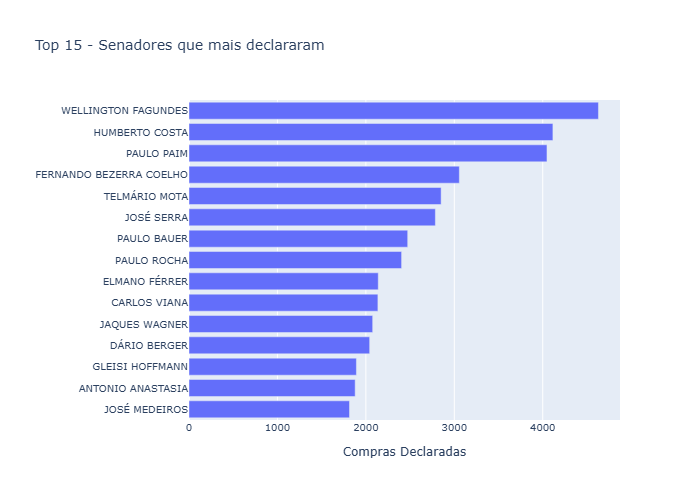
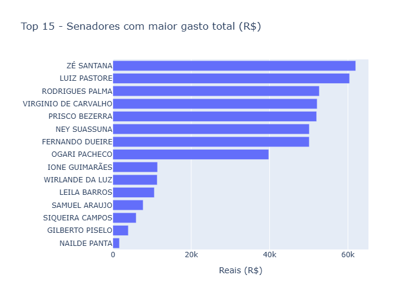
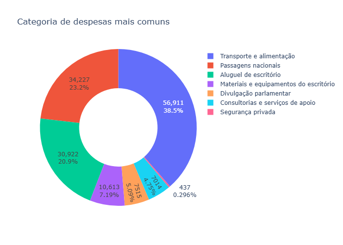
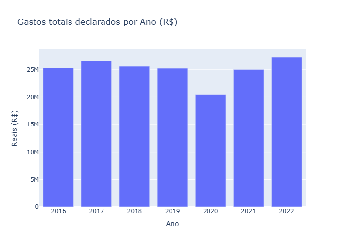
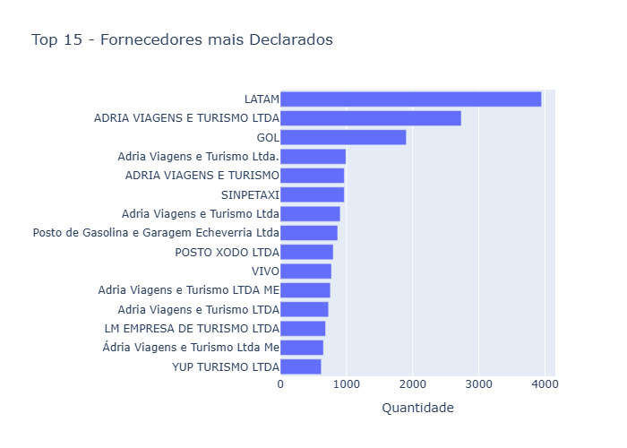

# Análise de Despesas dos Senadores (CEAPS)

## 📌 Descrição do Projeto
Este projeto analisa as despesas dos senadores brasileiros com base nos dados do CEAPS (Cota para Exercício da Atividade Parlamentar) dos anos de 2016 a 2022. O objetivo é praticar e entender **padrões de gastos, categorias mais comuns e comportamentos financeiros** dos parlamentares, usando técnicas de **limpeza, análise e visualização de dados**.

## 📊 Sobre os Dados 
Todos os dados utilizados estão disponiveis no site oficial do Senado: (https://www12.senado.leg.br/transparencia/dados-abertos-transparencia/dados-abertos-ceaps)

Esse projeto é totalmente e exclusivamente para estudo, em nenhum momento tive a intensão de julgar ou criticar nenhuma pessoa dessa pesquisa.

---

## 🎯 Objetivos
- Explorar e limpar o conjunto de dados das despesas parlamentares.  
- Analisar categorias de despesas: alimentação, passagens, hospedagem, locomoção, entre outras.  
- Comparar gastos entre senadores e períodos.  
- Criar visualizações interativas e gráficos informativos.  
- Gerar insights relevantes para **transparência pública**.
- Gerar imagens **.png** de todos os graficos.
- Criar um Dashboard totalmente online

---

## 💻 Tecnologias e Ferramentas
- **Python** – análise e manipulação de dados  
- **OS / Glob** - manipulação de arquivos
- **Pandas / NumPy** – tratamento e limpeza de dados  
- **Plotly** – visualização de dados  
- **Streamlit** - criação do dashboard
- **Jupyter Notebook** – documentação e exploração interativa  
- **Git/GitHub** – versionamento  

---

## 📊 Análises
- **Top 15 - Senadores com mais declarações**

- **Top 15 - Senadores com maior gasto total (R$)**

- **Categorias de despesa mais comuns**
  
- **Comparação de gastos por ano**
  
- **Top 15 - Fornecedores mais Declarados**  

- **Dashboard Streamlit**

[Em Breve]()

---

## Conecte-se comigo!
Estou aberto a trocar experiências sobre Python, Data Science e aprendizado contínuo. Me acompanhe para mais conteúdos sobre programação e análise de dados!

LinkedIn: [Celso Mamoru Siva Junior](https://www.linkedin.com/in/celso-mamoru-siva-junior-618ab116a)

---

#Python #CEAPS #DataAnalysis #Pandas #Portifolio #TechProject #CodingProject #PythonProject #DataScienceProject